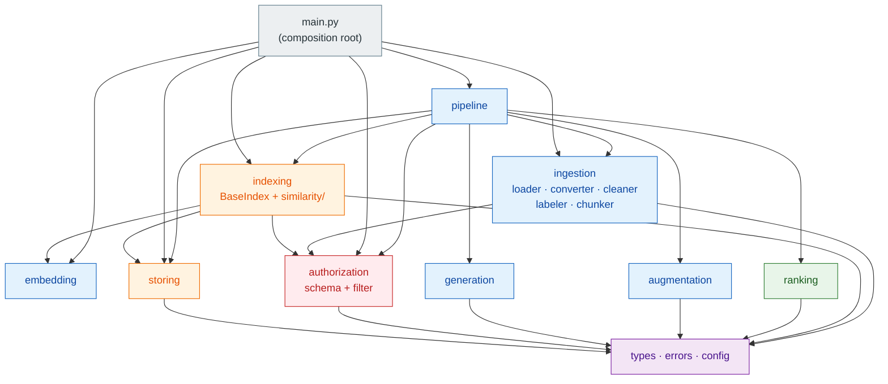
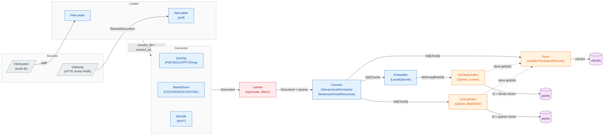
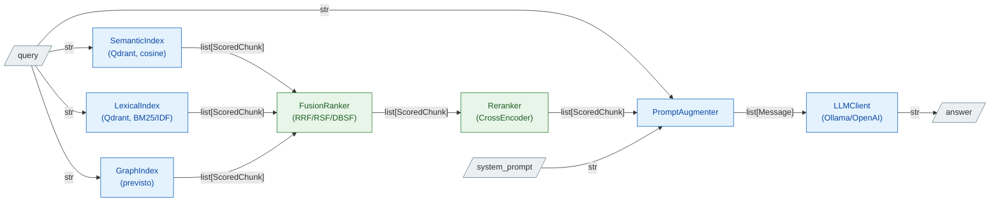

# Auth RAG — architettura

Questo documento descrive il **sistema base**: cosa fa la libreria, come è divisa in layer, quali
tipi scorrono fra un layer e l'altro, e — soprattutto — *perché* i confini stanno dove stanno.

Le due estensioni hanno un documento ciascuna, che parte da qui e non lo ridisegna:

| documento | asse |
|---|---|
| [roadmap/sources-abac.md](roadmap/sources-abac.md) | più sorgenti in ingresso, e il controllo accessi ABAC sul retrieval |
| [roadmap/graph.md](roadmap/graph.md) | il grafo di relazioni che allarga il contesto recuperato |

---

## 1. Cos'è

`auth-rag` è una **libreria Python in-process** (non un servizio) che offre un'interfaccia
unificata per la Retrieval Augmented Generation: acquisizione e parsing dei documenti, chunking,
indicizzazione ibrida (densa + sparsa), fusione dei ranking, reranking, costruzione del prompt e
generazione. Ogni stadio è una **porta** (ABC) con una o più implementazioni intercambiabili; chi
usa la libreria compone gli stadi che gli servono.

La tesi del progetto — il **grafo di espansione del contesto** — non è ancora scritta.
Il razionale sta nel [README](../README.md) e il piano in [roadmap/graph.md](roadmap/graph.md); qui
compare solo come `GraphIndex` *previsto* nei diagrammi, perché il punto d'innesto (un `BaseIndex`
come gli altri, accanto a quelli per similarità) è già deciso e non richiederà modifiche alla
pipeline.

Due cicli di vita separati, che condividono soltanto lo store e gli index:

- **Ingestion** (offline): legge le sorgenti, produce chunk, scrive store e index.
- **Query** (online): recupera, fonde, rerankizza, costruisce il prompt e genera la risposta.

---

## 2. Principi di design

Sono le sette regole da cui discende quasi tutta la struttura. Vale la pena leggerle prima del
resto, perché ogni scelta dei capitoli successivi è un'applicazione di una di queste.

**1. Porta e adattatori, senza factory.** Ogni stadio è una ABC che dichiara *cosa* fa; le
sottoclassi dicono *come*. Il cablaggio avviene in un solo posto — il **composition root**, oggi
[`main.py`](../main.py) — passando istanze concrete al costruttore. Nessuna factory, nessun
registry, nessuna stringa da risolvere a runtime: se serve un altro embedder, lo si costruisce e lo
si passa.

**2. L'API pubblica nomina la garanzia, non il vendor.** I tre tier si chiamano `Volatile`,
`Persistent`, `Remote` — non `Qdrant*`, `SQLite*`, `Postgres*`. Chi legge la firma deve capire *che
cosa gli è promesso* (dura? è condiviso fra processi?), non quale prodotto c'è sotto. Il motore
resta un dettaglio del costruttore, e sostituirlo non cambia il nome della classe.

**3. Il dato del chunk sta in un posto solo.** Lo `Store` è la verità su *cos'è* un chunk; ogni
index tiene **solo id più la propria rappresentazione** (vettore denso, vettore sparso, in futuro
nodi e archi) e risolve i chunk attraverso lo store condiviso. Niente duplicazione, niente
disallineamento fra due copie dello stesso testo.

**4. Idempotenza per costruzione.** L'id di un chunk è `source.id` + hash del contenuto, il point id
di Qdrant è un `uuid5` deterministico di quell'id, e ogni `add`/`insert` è un upsert. Re-ingerire lo
stesso corpus è un'operazione neutra, non un raddoppio.

**5. La sicurezza sta nel punto più basso che la può garantire.** L'enforcement ABAC vive in
`BaseIndex.retrieve`, non in `QueryPipeline`: gli index sono API pubblica e qualcuno li chiamerà
senza pipeline. Un controllo di sicurezza non può dipendere da quale wrapper è stato scelto.

**6. Fallire rumorosamente dove il problema è del deployment, in silenzio dove è del singolo dato.**
Un file corrotto viene saltato e loggato: riguarda quel file. Un attributo di accesso non dichiarato
solleva e ferma tutto: riguarda il fatto che il produttore del corpus e la dichiarazione non sono
d'accordo. Vedi il capitolo 9.

**7. Niente helper monouso.** Se una sottofunzione privata è chiamata da un posto solo, sta inline
con una docstring che spiega il perché.

---

## 3. Mappa dei package

```
src/auth_rag/
├── types.py              # il modello di dominio: cosa scorre fra i layer
├── errors.py             # la gerarchia di eccezioni della libreria
├── config.py             # Settings (env / .env), tipizzati
├── pipeline.py           # i tre coordinatori: Ingestion, Query, Rag (facade)
│
├── ingestion/            # sorgente -> list[Chunk]
│   ├── loader.py         #   acquisizione   (dove stanno i dati, come tirarli giù)
│   ├── converter.py      #   parsing        (byte + media_type -> markdown)
│   ├── cleaner.py        #   normalizzazione testuale (utility statica)
│   ├── labeler.py        #   attributi di accesso sul Source  [ABAC]
│   └── chunker.py        #   Document -> list[Chunk]
│
├── embedding/embedder.py # testo -> vettori densi
├── storing/store.py      # i dati dei chunk (id -> Chunk), condivisi
│
├── indexing/
│   ├── index.py          # BaseIndex: insert/delete/retrieve + enforcement ABAC
│   └── similarity/       # la famiglia "rilevanza per similarità alla query"
│       ├── index.py      #   meccanica Qdrant condivisa fra denso e sparso
│       ├── semantic_index.py  # denso, cosine
│       └── lexical_index.py   # sparso, BM25 con IDF server-side
│   └── (relation/)       # previsto: la famiglia "rilevanza per relazioni" — il grafo
│
├── ranking/
│   ├── ranker.py         # BaseRanker: ordinamento e taglio top-k deterministici
│   ├── fusion_ranker.py  # RRF / RSF / DBSF
│   └── reranker.py       # cross-encoder
│
├── augmentation/augmenter.py  # query + contesto -> list[Message]
├── generation/llm.py          # list[Message] -> risposta (Ollama / OpenAI)
│
└── authorization/        # trasversale: il contratto ABAC
    ├── schema.py         #   AccessSchema: il vocabolario dichiarato
    └── filter.py         #   Filter: l'algebra dei predicati + evaluate()
```

La superficie pubblica è ri-esportata da `auth_rag/__init__.py` con un `__all__` esplicito: è
quello il contratto verso chi importa la libreria, non i percorsi dei moduli.

### Direzione delle dipendenze

Le frecce si leggono come "importa":



Due proprietà da notare:

- **`types.py` non dipende da niente** e tutti dipendono da lui. È il vocabolario condiviso, ed è il
  motivo per cui i layer si parlano senza conoscersi.
- **`indexing/index.py` non importa nessun backend.** Importa `storing` e `authorization`, non
  Qdrant: è la ABC che rende possibile aggiungere la famiglia `relation/` (grafo) senza toccare
  niente della famiglia `similarity/`.

---

## 4. I tipi che scorrono

Tutti modelli pydantic in [`types.py`](../src/auth_rag/types.py).

| Tipo | Campi | Note |
|---|---|---|
| `RemoteDocument` | `data` (base64→bytes), `media_type`, `external_id`, `title`, `time`, `access` | Il contratto col mondo esterno: **byte + media type**, non testo. |
| `Source` | `id`, `name`, `origin`, `time`, `access` | Il documento d'origine. `id` è la chiave di cancellazione. |
| `Document` | `text`, `source` | Il documento già convertito in testo/markdown. |
| `Metadata` | `source`, `title`, `page?` | Porta il `Source` per riferimento: il chunk eredita tutto. |
| `Chunk` | `id`, `text`, `metadata` | `id = f"{source.id}:{content_hash(text)}"`. |
| `ScoredChunk` | `chunk`, `score` | Ciò che esce da ogni index e da ogni ranker. |
| `Message` | `role` (system/user/assistant), `content` | Il trasporto neutro fra augmenter e LLM. |

Più due enum: `Origin` (`local` / `remote`, **impostato dal loader**, mai letto dal payload — un
servizio esterno non deve poter dichiarare da dove è arrivato) e `Language` (i cui valori sono
esattamente i nomi che lo stemmer Snowball e le stopword NLTK si aspettano, così un membro si passa
direttamente a entrambi).

**Perché `access` sta su `Source` e non su `Metadata`.** L'accesso è una proprietà del documento
sorgente, non della singola porzione di testo. Mettendolo lì ogni chunk lo eredita per costruzione —
nessuno copia niente — e l'enforcement ha **un solo posto** da cui leggere
(`chunk.metadata.source.access`). Il prezzo è che gli attributi sono *strutturalmente* uniformi per
documento: `source.id` è la chiave di cancellazione e dev'essere identico su tutti i chunk, quindi
non esistono `Source` diversi per chunk dello stesso documento.

**L'id del chunk.** `content_hash` è uno SHA-256 troncato a 32 caratteri. Prefissarlo con
`source.id` dà due proprietà in una: lo stesso testo in due documenti diversi resta due chunk
distinti, e un id porta con sé il documento a cui appartiene. È anche ciò che rende `add` un upsert
naturale — riconvertire lo stesso file produce gli stessi id.

---

## 5. Ingestion (offline)



### 5.1 Loader — acquisizione

`BaseLoader.load() -> Iterator[Document]`. Il `yield` non è estetico: un corpus può non stare in
memoria, e **un record guasto viene saltato e loggato senza abortire il batch**.

- `LocalLoader` / **`FileLoader`** — legge una directory in ordine alfabetico, converte ogni file,
  opzionalmente salva il markdown prodotto (utile per ispezionare cosa ha visto davvero il chunker).
  L'id del documento è il **nome del file**: stabile nella directory, ed è la chiave con cui più
  tardi si cancella.
- `RemoteLoader` / **`ApiLoader`** — pull HTTP da un servizio esterno. `_fetch()` isola il trasporto
  (endpoint, header di auth, timeout, e domani paginazione e retry); `_to_document` è il **contratto**
  fra il servizio e i tipi della libreria e non è overridabile per capriccio.

**Acquisizione ≠ parsing.** Due assi ortogonali, due astrazioni. Il loader sa *dove* stanno i dati;
il converter sa *come* si leggono. Il routing formato→parser sta nel converter, condiviso dai due
rami: un PDF viene parsato allo stesso modo che arrivi dal disco o da un gateway.

**FHIR non entra qui.** È un *gateway esterno* (altra repo) a parlare FHIR — auth, consenso,
paginazione dei `Bundle`, risoluzione dei `Binary` — e a consegnare alla libreria documenti neutri:
solo byte + `media_type` + gli attributi di accesso che dai soli byte non si ricavano.

### 5.2 Converter — parsing

`MarkdownConverter` fa dispatch sul **media type**, con una tabella dichiarativa (`FORMATS`) da cui
sono derivati tre indici di lookup. Aggiungere un formato è **una riga**:

| parser | formati | perché |
|---|---|---|
| Docling | PDF, DOCX, PPTX, PNG, JPEG | layout ricco: tabelle, colonne, opzionalmente OCR |
| MarkItDown | XLSX, CSV, JSON, HTML | strutturato / tabellare / web |
| decode | Markdown, plain text | già testo |

Un media type non mappato solleva `ConversionError` — mai un fallback silenzioso a "decodifica e
spera". Il file si risolve il media type dall'estensione, il payload remoto se lo fa dire dal
gateway; da lì in poi il percorso è identico.

### 5.3 Cleaner — normalizzazione

Tre funzioni statiche pure (`make_plain`, `normalize_newlines`, `remove_control_chars`).
**Non è cablato nella pipeline**: è a disposizione di chi scrive un loader o un chunker e sa che
cosa il suo corpus ha bisogno di perdere. Normalizzare a monte indiscriminatamente distruggerebbe la
struttura markdown su cui poi `HierarchicalChunker` lavora.

### 5.4 Labeler — gli attributi di accesso `[ABAC]`

Sta **fra loader e chunker**, e scrive gli attributi validati su `document.source.access`, una volta
sola per documento. Il chunker copia già `doc.source` dentro ogni `Metadata`, quindi l'eredità è
gratuita.

Il principio che tiene sano tutto il resto:

> **etichettare ≠ decidere.** Il labeler marca il dato per *cosa è*, mai per *chi lo vede*. Le regole
> vivono nel PDP, fuori dalla libreria; cambiare una regola non deve **mai** forzare una
> re-ingestione.

`BaseLabeler.label()` è condiviso — valida con `schema.validate_access` e restituisce una copia — e
le sottoclassi dicono soltanto *da dove vengono i valori*:

| implementazione | origine dei valori | quando |
|---|---|---|
| `PropagatingLabeler` | già arrivati col documento | percorso principale: c'è un produttore a monte (gateway, sidecar) |
| `ManifestLabeler` | JSON `{default, sources}` su `source.id` | corpus curato a mano, nessuno a monte |
| `StaticLabeler` | costanti | una pipeline il cui corpus condivide gli attributi |

Un attributo invalido o mancante **solleva** (`ConformanceError` arricchito con l'id del documento —
l'unica cosa che lo schema non può sapere), non salta il documento: è un disaccordo fra il produttore
e la dichiarazione, e riguarda l'intero corpus. Accettare un documento privo degli attributi
`required` significherebbe scrivere qualcosa che si sa già di non poter mai restituire, rimandando il
sintomo a query time sotto forma di lista vuota indistinguibile da un deny legittimo.

Il labeler è **opzionale**: senza `AccessSchema` non c'è ABAC e non c'è labeler. Vedi il capitolo 8.

### 5.5 Chunker — `Document -> list[Chunk]`

Cinque strategie, stessa firma, id costruito dalla base comune:

| chunker | criterio di taglio | costo | quando |
|---|---|---|---|
| `HierarchicalChunker` | gerarchia dei titoli markdown | nullo | **default**: il converter produce markdown, quindi la struttura c'è già. Popola `metadata.title` col path delle sezioni (`Cap > Par > Sottopar`) |
| `SentenceChunker` | N frasi con overlap (NLTK) | basso | testo continuo senza struttura |
| `RecursiveCharacterChunker` | separatori in cascata fino a stare nella dimensione | basso | garanzia dura sulla dimensione, rispettando i confini naturali |
| `FixedSizeChunker` | finestra di caratteri con overlap | nullo | baseline e test |
| `SemanticChunker` | calo di similarità coseno fra frasi adiacenti | **alto** (un encoder per frase) | corpus dove il tema cambia senza segnali tipografici |

`HierarchicalChunker` è l'unico che riempie `title`, e questo si vede a valle: il `PromptAugmenter`
lo cita nell'header di ogni fonte, quindi l'LLM sa *da quale sezione* viene ciò che sta leggendo.

---

## 6. Storage e indexing

È il confine architetturale più importante della libreria, e l'unico che vale la pena rileggere due
volte.

### 6.1 Store — cos'è un chunk

`BaseStore`: `add(chunks)` (upsert idempotente su `chunk.id`), `get(ids)` (gli id mancanti si
saltano, non sono un errore), `delete(source_id)` (cancella ogni chunk di un documento).

| tier | backend | garanzia |
|---|---|---|
| `VolatileStore` | dict in memoria | zero setup, perso all'uscita del processo |
| `PersistentStore` | SQLite (file singolo, stdlib) | durevole, singolo processo |
| `RemoteStore` | Postgres | durevole e **condiviso fra processi** — è il tier che permette a un worker di ingestion e a un'API di query di essere due processi distinti |

I tier differiscono **solo** nella tecnologia sottostante, mai nel comportamento. Entrambi quelli
durevoli accettano una connessione iniettata, che è anche come i test girano senza toccare il disco.

### 6.2 Index — come si trova un chunk

`BaseIndex`: `insert(chunks)`, `delete(source_id)`, `_search(query, top_i) -> [(chunk_id, score)]`
(primitiva del backend) e `retrieve(query, top_i, filter)` — l'entry point pubblico, **concreto
nella base**, dove vive l'enforcement: stando lì, nessun autore di un nuovo index può ometterlo.

Un index tiene **solo id più la propria rappresentazione** e **non scrive mai lo store**. La
divisione dei compiti in scrittura è netta:

- `IngestionPipeline.ingest` scrive lo store **una volta**, poi dice a ogni index di indicizzare gli
  stessi chunk.
- `IngestionPipeline.remove` fa il contrario: prima toglie gli id da **ogni** index, poi cancella i
  record dallo store. Nessun id pendente, nessun orfano.

#### La famiglia `similarity/`

Lo split fra famiglie di index è **per come si assegna la rilevanza**: `similarity` valuta ogni chunk
per conto suo rispetto alla query, `relation` (previsto, il grafo) lo valuta per le sue relazioni.

`SimilarityIndex` contiene la meccanica Qdrant condivisa: point id (`uuid5` del `chunk.id`, così il
re-insert fa upsert in place), payload (`chunk_id` per risolvere, `source_id` per cancellare),
cancellazione per filtro, e la chiamata di ricerca. Le sottoclassi forniscono soltanto la creazione
della collection e `_query_vector`. Così il denso e lo sparso **non possono divergere**.

| index | rappresentazione | motore |
|---|---|---|
| `SemanticIndex` | vettore denso, distanza coseno | embedder iniettato (`LocalEmbedder` via SentenceTransformers, o `OpenAIEmbedder`) |
| `LexicalIndex` | vettore sparso BM25 | FastEmbed `Qdrant/bm25` per tokenizzazione, stemming e stopword; **IDF calcolata server-side** da Qdrant col modificatore `IDF` — quindi è BM25 vero, identico su tutti i tier |

Il payload dell'index porta *solo ciò su cui l'index deve agire senza leggere lo store*. Non porta
il testo: quello sta nello store, e duplicarlo vorrebbe dire tenerne allineate due copie.

### 6.3 I tre tier, e perché si chiamano così

Ogni index esiste in tre varianti che **differiscono solo in come viene costruito il client Qdrant**:

| classe | costruzione | uso |
|---|---|---|
| `Volatile*Index` | `QdrantClient(location=":memory:")` | test e prototipi; zero setup |
| `Persistent*Index` | `QdrantClient(path=...)` | Qdrant embedded su disco, singolo processo |
| `Remote*Index` | `QdrantClient(url=...)` | server Qdrant, condiviso fra processi |

Il nome dice la **garanzia** (dura? è condiviso?), non il prodotto. Il giorno in cui il motore denso
non fosse più Qdrant, il codice chiamante non cambierebbe una riga.

La configurazione coerente è quella in cui store e index stanno sullo **stesso tier**: uno store
volatile con un index remoto sopravvive al riavvio come un insieme di id che non risolvono più
niente.

---

## 7. Query (online)



### 7.1 L'imbuto: `top_i` → `top_k` → `top_n`

Tre soglie, tre stadi, costi crescenti per documento:

| soglia | dove | default | significato |
|---|---|---|---|
| `top_i` | per **ogni** index | 20 | quanti candidati tira su ciascun retriever |
| `top_k` | dopo la fusione | 10 | quanti sopravvivono al merge, e vanno al reranker |
| `top_n` | dopo il reranking | 5 | il contesto finale che vede l'LLM |

Il reranker è un cross-encoder: costa una forward pass per **coppia** (query, chunk), quindi non lo
si può puntare su tutto il corpus. L'imbuto esiste perché i primi due stadi sono economici e
selettivi, e il terzo è caro e preciso.

### 7.2 Fusion ranker — mettere insieme liste incommensurabili

Un coseno sta in `[-1, 1]`, un BM25 no. Sommare i due numeri non significa niente, e da qui le due
famiglie:

| ranker | cosa legge | proprietà |
|---|---|---|
| `ReciprocalRankFusionRanker` (RRF) | **solo le posizioni**: `weight / (k + rank)` | immune alla scala. Un documento trovato da entrambi i retriever sale; uno trovato da uno solo prende zero dall'altro. È il default |
| `RelativeScoreFusionRanker` (RSF) | min e max di ciascuna lista | usa l'informazione del *quanto*, ma il minimo osservato è un riferimento fragile |
| `DistributionScoreFusionRanker` (DBSF) | media ± σ·std di ciascuna lista | stessa idea, riferimento più stabile al crescere del pool |

I pesi di RSF/DBSF sono riscalati a somma 1, così si leggono come proporzioni e il punteggio fuso
resta in `[0, 1]`.

Due dettagli che sembrano minori e non lo sono:

- `BaseRanker.extract_top_k` ordina per `(-score, chunk.id)`: **i pareggi si rompono sull'id**,
  quindi il ranking non dipende dall'ordine in cui i chunk sono arrivati. Senza, la stessa query
  potrebbe dare due risposte diverse.
- `_search` deve restituire id **unici**: un chunk che comparisse due volte nella stessa lista
  verrebbe contato due volte dalla fusione.

*(Conseguenza per il grafo: uno score di traversata non è commensurabile con coseno e BM25, e RSF/DBSF
normalizzano sulla forma della sua curva. Introdurre il grafo di fatto vincola a RRF — vedi
[roadmap/graph.md](roadmap/graph.md).)*

### 7.3 Augmentation e generation

`PromptAugmenter` costruisce `list[Message]`: un messaggio `system` con le istruzioni e uno `user`
che contiene domanda e contesto. Ogni chunk entra sotto un header che ne cita **sorgente e titolo di
sezione**, numerato, così la risposta può citare le fonti. Con contesto vuoto il prompt lo dice
esplicitamente ("Nessuna fonte trovata"), invece di lasciare una sezione vuota che il modello
riempirebbe di suo.

`BaseLLMClient` consuma `list[Message]` e offre `answer` e `stream`. Il trasporto neutro è la
ragione per cui `OllamaClient` e `OpenAIClient` si sostituiscono senza toccare nient'altro:
**l'assemblaggio del prompt è dell'augmenter, non del client**.

---

## 8. Authorization (ABAC) — trasversale

Implementato nel base; ciò che manca sta in
[roadmap/sources-abac.md](roadmap/sources-abac.md). Qui il contratto com'è oggi.

**La libreria non vede mai l'identità.** Decide chi sta a monte (un PEP, che a sua volta interroga un
PDP), applicano gli index. La libreria fornisce il **vocabolario** e il **linguaggio del predicato**,
e garantisce che il predicato venga applicato.

### 8.1 `AccessSchema` — una dichiarazione, tre consumatori

Il vocabolario chiuso degli attributi che un deployment dichiara, caricato da un file JSON
(`AccessSchema.from_file`, path in `Settings.access_schema_path`). È un **file** e non un oggetto
perché ingestion e query possono essere processi distinti, e devono leggere la stessa dichiarazione —
lo stesso vale per il gateway che produce gli attributi a monte.

```json
[
  { "name": "tenant",         "type": "keyword", "required": true },
  { "name": "classification", "type": "keyword", "required": true },
  { "name": "care_team",      "type": "keyword", "multi": true }
]
```

| consumatore | metodo | quando |
|---|---|---|
| Labeler | `validate_access` | ingestion: valida ciò che si scrive, e verifica che i `required` ci siano |
| Index | `is_labeled` | query: il gemello che **non solleva**, perché un chunk non etichettato va negato in silenzio |
| Index (per conto del PEP) | `validate_filter` | query: rifiuta un predicato che nomina un attributo mai dichiarato |

`Attribute` è `extra="forbid"`: un typo nel file (`requird`) lascerebbe altrimenti l'attributo
opzionale mentre chi l'ha scritto lo crede obbligatorio — un errore che **fallisce aperto**. Per lo
stesso motivo uno schema vuoto, o che non dichiara nessun attributo `required`, viene rifiutato alla
costruzione.

### 8.2 `Filter` — l'algebra neutra

Né il dialetto del policy engine né quello del backend:

```python
Match(attribute=..., values={...})   # l'attributo vale uno di quei valori (copre eq e in)
And(clauses=[...])                   # rifiuta la congiunzione vuota: vera per vacuità
Or(clauses=[...])
Not(clause=...)
Allow()                              # "nessuna restrizione", detto esplicitamente
```

Nodi immutabili, costruiti **solo per keyword**, con un tag `type` e clausole tipizzate come unione
discriminata (`Clause`). Il tag non è decorativo: senza, pydantic serializzerebbe secondo il tipo
*dichiarato* — la base, priva di campi — e un predicato uscirebbe come `{"clauses":[{},{}]}` **senza
sollevare niente**. Per un log di audit è peggio di un errore. Scrivere è
`predicate.model_dump_json()`; rileggere passa da `FilterAdapter`.

`evaluate(predicate, access)` è la **semantica di riferimento**, con tre ruoli: enforcement
autorevole in `BaseIndex.retrieve`, fallback per i backend che non filtrano, e oracolo contro cui
testare un futuro pushdown. Due comportamenti su cui si conta: un attributo che il chunk non porta
**non matcha mai**, e i valori si confrontano anche per tipo (`True` non soddisfa un filtro che
chiede `1`).

### 8.3 Schema e filtro vanno insieme, nei due sensi

In `BaseIndex.retrieve`, prima di qualunque ricerca:

| schema | filtro | esito |
|---|---|---|
| assente | assente | lettura non filtrata — **ma** se i chunk risultanti portano attributi, `EnforcementError`: qualcuno ha etichettato in ingestion e qui nessuno applica niente |
| presente | assente | `EnforcementError`. `Allow()` è come si dichiara di non avere restrizioni |
| assente | presente | `EnforcementError`. Non c'è vocabolario contro cui validare, e senza la nozione di attributo `required` una negazione pura ammetterebbe un chunk non etichettato |
| presente | presente | validazione del predicato, poi `is_labeled` **e** `evaluate` su ogni candidato |

Il filtro si applica **prima della fusione**, e questo è il punto preciso da non spostare. Non perché
"pre" suoni meglio di "post", ma perché il riferimento è il **ranker**: RRF legge le *posizioni*
dentro ogni lista e RSF normalizza su *minimo e massimo* di ogni lista. Lasciarci dentro chunk non
autorizzati significa che quei chunk spostano il rank di quelli autorizzati e fissano i limiti di
normalizzazione — cioè **il punteggio di ciò che vedi dipenderebbe da ciò che non puoi vedere** — e
`top_k` smetterebbe di contare risultati autorizzati.

Il controllo in Python resta **anche** quando un backend saprà filtrare da solo (pushdown, non ancora
implementato): un index che traducesse male il predicato restituirebbe *meno*, non *di più*.

### 8.4 Il confine

> chi decide il filtro sta a monte, chi lo applica sta negli index

`QueryPipeline.retrieve/query/stream` accettano un `filter` e lo passano agli index **senza
interpretarlo**. Non decide nemmeno se possa essere omesso: quella regola vive nell'index, e
duplicarla creerebbe solo un secondo posto in cui sbagliarla.

Il PEP — che ha bisogno dell'identità verificata, che la libreria non vede mai — sta **fuori**. È
l'ultimo pezzo mancante dell'ABAC, ed è per costruzione un altro progetto.

---

## 9. Errori

```
RagError                     (non è un ValueError, deliberatamente)
├── ConversionError          nessun parser per quel media type
└── AuthorizationError
    ├── DeclarationError     un file di dichiarazione è inutilizzabile → rifiutarsi di partire
    ├── ConformanceError     attributi o predicato in disaccordo con lo schema dichiarato
    └── EnforcementError     questa chiamata non è applicabile come chiesta (errore di cablaggio)
```

`RagError` **non** eredita da `ValueError` per una ragione concreta: un chiamante che avvolge una
chiamata in `except ValueError` per difendersi da input malformati non deve **inghiottire per
sbaglio un fallimento di autorizzazione**. Queste vanno prese apposta, o non prese affatto.

La validazione ordinaria degli argomenti — un overlap più largo del chunk, pesi che sommano a zero —
resta un `ValueError` semplice, perché è esattamente quello che è: il chiamante ha passato qualcosa
di sbagliato, e nulla del deployment è in gioco.

---

## 10. Configurazione e composition root

`Settings` (pydantic-settings) legge da variabili d'ambiente o da `.env`; i nomi dei campi mappano
sulle variabili maiuscole (`llm_url` → `LLM_URL`). **Tutto ha un default sensato locale**, quindi un
ambiente vuoto funziona — con due eccezioni deliberate: `access_schema_path` e
`access_manifest_path` sono `None` di default, perché la libreria non ha un'opinione su dove stia
quel file e la sua assenza *significa qualcosa* (nessun ABAC).

Il cablaggio sta in [`main.py`](../main.py), che è il composition root: legge le `Settings`, decide i
tier, costruisce le istanze concrete e le passa. È anche l'unico posto che conosce l'ambiente — la
libreria no.

```python
store = VolatileStore()                       # un solo store, condiviso
schema = AccessSchema.from_file(p) if p else None   # la presenza distingue il deployment

rag = RagPipeline(
    loader=FileLoader(settings.in_dir, settings.out_dir, save_output=True),
    labeler=labeler,                          # None se schema è None
    chunker=HierarchicalChunker(),
    store=store,
    indexes=[
        VolatileSemanticIndex(store, embedder, schema=schema),
        VolatileLexicalIndex(store, language=settings.language, schema=schema),
    ],
    ranker=ReciprocalRankFusionRanker(),
    augmenter=PromptAugmenter(system=...),
    llm=OllamaClient(model=settings.llm_model, url=settings.llm_url),
    top_i=settings.top_i, top_k=settings.top_k, top_n=settings.top_n,
)
```

`RagPipeline` è una **facade**: costruisce `IngestionPipeline` e `QueryPipeline` e non fa altro.
Store e index sono condivisi fra le due, ed è questo a garantire che ciò che l'ingestion scrive sia
esattamente ciò che la query legge. Chi ha un solo lato dei due (un worker di ingestion, un'API di
query) istanzia direttamente la pipeline che gli serve.

---

## 11. Estendere il sistema

Tabella di lettura rapida: dove si aggancia una cosa nuova, e cosa **non** va toccato.

| voglio… | implemento | nient'altro cambia perché… |
|---|---|---|
| una nuova sorgente | `BaseLoader` (o `RemoteLoader`, con solo `_fetch`) | tutti producono `Document` |
| un nuovo formato | una riga in `FORMATS` | i tre indici di lookup sono derivati |
| una nuova strategia di taglio | `BaseChunker` | `_make_chunk` costruisce id e metadata |
| una nuova origine di attributi | `BaseLabeler._attributes` | validazione e scrittura sono condivise |
| un nuovo modello di embedding | `BaseEmbedder` | il `SemanticIndex` lo riceve iniettato |
| un nuovo backend di storage | `BaseStore` | gli index conoscono solo la ABC |
| **una nuova famiglia di retrieval** (il grafo) | `BaseIndex` | `BaseIndex` non importa nessun backend; la `QueryPipeline` non cambia |
| una nuova strategia di fusione | `FusionRanker` | riceve `list[list[ScoredChunk]]` |
| un nuovo LLM | `BaseLLMClient` | consuma `list[Message]`, neutro |

Il caso più importante è la riga in grassetto: il `GraphIndex` entrerà come un `BaseIndex` qualsiasi
— `insert`/`delete`/`retrieve`, solo id più la sua rappresentazione, chunk risolti dallo store
condiviso, `list[ScoredChunk]` al `FusionRanker`. **Nessun trattamento speciale nella pipeline.**
Questa proprietà è il motivo per cui lo split store/index è stato fatto quando è stato fatto.

---

## 12. Test

Test unitari con `pytest` sotto `test/`, in parallelo alla struttura del sorgente. Le scelte che
li rendono possibili sono le stesse che rendono sano il design:

- **Il tier volatile è vero.** Qdrant `:memory:` e `VolatileStore` fanno girare store e index per
  intero in-process — non un mock, il codice reale con un client diverso.
- **Le connessioni sono iniettabili.** `PersistentStore` accetta una `sqlite3.Connection`
  (`:memory:` nei test), `RemoteStore` una `psycopg.Connection`.
- **`evaluate` è una funzione pura**, quindi la semantica del filtro si testa senza nessuna
  infrastruttura — ed è anche l'oracolo con cui si verificherà il pushdown quando ci sarà.

Copertura più densa dove il costo di sbagliare è più alto: `authorization/` (40 test fra schema e
filtro) e `indexing/index.py` (16, quasi tutti sulle combinazioni schema/filtro del capitolo 8.3).

---

## 13. Cosa non c'è ancora

Onestà su ciò che questo documento **non** descrive, perché non esiste:

| | stato | dove |
|---|---|---|
| **Grafo di espansione** (la tesi) | nessun package `relation/`; decisioni prese, una aperta blocca l'inizio | [roadmap/graph.md](roadmap/graph.md) |
| **PEP** (`compile_filter(subject, action, env) -> Filter`) | fuori dalla libreria per costruzione: ha bisogno dell'identità verificata | [roadmap/sources-abac.md](roadmap/sources-abac.md) |
| **PDP XACML esterno** | il filtro arriverà come *obligation*; soffitto noto: solo congiunzioni | [roadmap/sources-abac.md](roadmap/sources-abac.md#pdp-esterno-xacml-il-filtro-arriva-come-obligation) |
| **Pushdown del filtro nel payload dell'index** | additivo: cambia il recall e le prestazioni, non *se* il filtro c'è | [roadmap/sources-abac.md](roadmap/sources-abac.md) |
| **Gateway FHIR** | altra repo; la libreria lo consuma già via `ApiLoader` | [roadmap/sources-abac.md](roadmap/sources-abac.md) |
| **Harness di valutazione** (recall@k, nDCG) | **blocco trasversale**: senza, RRF contro DBSF, quanto valga il reranker e se il grafo paghi restano opinioni | [roadmap/graph.md](roadmap/graph.md#cosa-manca-per-sapere-se-il-grafo-paga) |

L'ultima riga è quella che condiziona le altre: la sequenza sensata mette l'harness **prima** del
grafo, non dopo.
