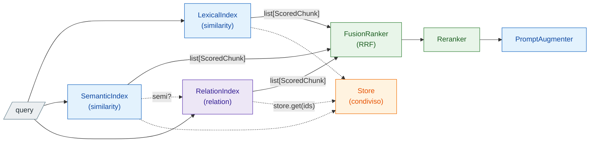

# Roadmap — il grafo di espansione

Una delle due estensioni di [l'architettura di base](../architecture.md); l'altra è
[multi-source + ABAC](sources-abac.md). Questa aggiunge un **grafo di relazioni** che allarga
l'insieme di chunk recuperati oltre a ciò che la similarità raggiunge.

È la tesi del progetto, ed è **l'unica parte non ancora scritta**. Il vecchio nome della repo
(`autograph-rag`) veniva da qui; dopo il rename in `auth-rag` il nome indica l'estensione
implementata — l'ABAC — invece della tesi ancora da scrivere.

## Stato (27 agosto 2026)

- **Niente implementato.** Non esiste nessun package `relation/`. Nei diagrammi del base il
  `GraphIndex` compare come *previsto*, cablato al `FusionRanker` accanto agli altri due.
- **Decisioni già prese**, da non rimettere in discussione: lo split `similarity`/`relation`
  per *come si assegna la rilevanza*, l'index del grafo come ABC **pura**, il tier volatile
  su networkx **per primo**, e nomi-tier invece di nomi-vendor nell'API pubblica.
- **Una decisione aperta blocca l'inizio**: l'ABAC sul grafo, perché determina dove vivono
  gli attributi. Vedi l'ultima sezione.

## L'inversione rispetto a GraphRAG

Nel Graph RAG canonico il grafo **è** l'indice: un estrattore di entità e relazioni costruisce
una base di conoscenza in cui ogni nodo è un'embedding specifica, e la query naviga il grafo
per trovare i chunk correlati. Questo pretende che l'estrazione sia accurata abbastanza da
produrre relazioni informative e non ridondanti — cioè pretende esperti di dominio e un costo
di costruzione alto.

Qui i ruoli sono invertiti:

> il **vector store resta l'indice principale**; il grafo ci sta sopra e serve **solo** a
> espandere il contesto.

Tre conseguenze che definiscono il design:

- **I nodi sono sottoconcetti**, non embedding. Più sottoconcetti possono risolvere allo
  stesso chunk, il che dà a un singolo vettore **più punti d'ingresso relazionali**.
- **Gli archi collegano chunk diversi** legati da una relazione esplicita, ed è lì che si
  guadagna: proprio quando quei chunk **non sono semanticamente simili**, e la similarità da
  sola non li avrebbe mai messi insieme.
- **Il grafo può essere grossolano.** Gli basta registrare che due nodi appartenenti a chunk
  diversi sono in relazione; non deve essere una mappa fedele del dominio. Quindi è leggero
  da costruire e poco costoso da mantenere — che è tutto il punto economico della tesi.

Al momento della query si parte come in un RAG classico, entrando per similarità, e il grafo
**allarga** il risultato.

## Dove si innesta

Il grafo è un **`BaseIndex` come gli altri**: `insert`/`delete`/`retrieve`, tiene solo id più
la sua rappresentazione, risolve i chunk dallo `Store` condiviso e restituisce
`list[ScoredChunk]` che il `FusionRanker` fonde. Nessun trattamento speciale nella pipeline,
e nessuna modifica a `QueryPipeline`.

Lo split fra le due famiglie è **per come si assegna la rilevanza**: `similarity` valuta ogni
chunk per conto suo, `relation` lo valuta per le sue relazioni. È anche il motivo per cui
`BaseIndex` non importa nessun backend.

A differenza di `similarity/index.py`, che contiene la meccanica Qdrant condivisa fra denso e
sparso, **`relation/index.py` è una ABC pura**: networkx e un graph DB sono motori
genuinamente diversi, non due modi di costruire lo stesso client.

L'arco tratteggiato `SemanticIndex ⇢ RelationIndex` ha un punto di domanda apposta: il grafo
ha bisogno di **semi** da cui partire, e da dove vengano è una decisione aperta.

## Il problema centrale: da un cammino a uno score

`_search` deve restituire `(chunk_id, score)`, "più alto = più rilevante". Da una traversata
ottieni **raggiungibilità**, non una misura di similarità. Come la si converte è la scelta
tecnica più delicata, e le opzioni non sono equivalenti:

| criterio | pro | contro |
|---|---|---|
| decadimento per distanza (`seed * α^hop`) | semplice, monotono, un parametro | ignora quanto la relazione sia forte |
| numero di cammini distinti | premia la corroborazione | costoso, sensibile alla densità del grafo |
| peso o confidenza dell'arco | più informativo | dipende dalla calibrazione di un LLM |
| score del seme propagato | mantiene la scala della similarità | appiattisce tutti i vicini di uno stesso seme |

**Conseguenza da mettere per iscritto prima di scegliere.** Qualunque di questi score **non è
commensurabile** con un cosine o con BM25. A RRF non importa, perché legge solo le
**posizioni** dentro ogni lista. Ma RSF e DBSF normalizzano su minimo/massimo e su
media/deviazione della lista, quindi darebbero al grafo un peso arbitrario deciso dalla forma
della curva di decadimento. Detto altrimenti: **introdurre il grafo vincola il fusion ranker
a RRF**, a meno di calibrare esplicitamente gli score del grafo — cosa che senza harness di
valutazione non si può fare.

## Costruzione: nodi, archi, e il problema dell'idempotenza

In ingestion serve un estrattore che, letto un chunk, produca i sottoconcetti e le relazioni.
I nodi si **fondono per nome** fra chunk diversi: è esattamente ciò che crea i ponti.

La fusione per nome ha però una conseguenza che vale anche fuori dalla sicurezza: **un nodo
appartiene a più chunk**, quindi non è un buon posto in cui mettere niente di specifico di un
chunk. Gli **archi** invece hanno provenienza univoca, perché l'estrattore legge un chunk per
volta.

**Il vincolo che sottovaluterei a mio rischio.** Un estrattore LLM non è deterministico,
mentre gli id dei chunk sono content-hash e lo store fa upsert idempotente. Se la stessa riga
di testo produce nodi diversi a ogni ingestione, il grafo divergerebbe dai chunk e la
re-ingestione smetterebbe di essere un'operazione neutra. È lo stesso problema che ha fatto
rimandare il labeler *inferito* — solo che qui non si può rimandare, perché il grafo **è**
inferenza. Due modi per uscirne: estrazione a temperatura zero con prompt e modello
versionati, oppure grafo ricostruito per sorgente invece che per chunk.

## L'ABAC sul grafo — la decisione che blocca tutto

L'analisi sta in [sources-abac.md](sources-abac.md#aperto-labac-sul-graphindex). Il riassunto,
con ciò che è cambiato da allora:

Sui due index per similarità il filtro è una condizione sulla **selezione dei candidati**. Sul
grafo no: l'espansione avviene per **traversata**, quindi il filtro interagisce con la
*raggiungibilità* — il sottografo percorribile è diverso per ogni soggetto, e i cammini che
esistono per uno non esistono per un altro.

- **Attributi sugli archi, filtro a ogni hop.** Espansione dimostrabilmente chiusa: il
  sottografo raggiunto deriva solo da dati che il soggetto può vedere. Prezzo: un costrutto
  critico per la sicurezza dove un errore è un leak silenzioso, e difficile da coprire con i
  test.
- **Traversata libera, filtro sui chunk risultanti.** Uniforme — gli attributi restano solo
  sul chunk, un solo punto di filtro — e nessuna duplicazione di dati di sicurezza nel grafo,
  quindi nessuna staleness.

**Cosa è realmente in gioco**: non un leak di contenuto, perché `_search` restituisce solo
`(chunk_id, score)` e i nodi intermedi non sono osservabili. È un **canale inferenziale**: un
cammino che passa per chunk vietati può far risalire in classifica un chunk *autorizzato* che
altrimenti non c'entrava, quindi l'ordinamento di ciò che vedi dipende da ciò che non vedi — e
con molte query mirate diventa sondabile.

> **Novità del 27 agosto, e sposta il conto.** `access` ora sta su **`Source`** e non su
> `Metadata`, quindi gli attributi sono **uniformi per documento** e un chunk non può averne
> di propri. Un arco nasce da un chunk, quindi eredita gli attributi del suo documento: la
> prima posizione costa meno di quanto sembrasse, perché non serve un modello di sicurezza
> nuovo per gli archi — basta propagare il `Source`. Resta vero però che sarebbe un **secondo
> punto di enforcement** da tenere allineato al primo, e che l'enforcement duplicato è
> precisamente il tipo di cosa che diverge in silenzio.

Se si scegliesse la seconda posizione va aggiunto l'**over-fetch**, e va annotato che il
principio "mai post-filtering" è stato consapevolmente derogato per il solo stadio di
espansione — dove costa bonus mancati, non risultati primari mancati.

## Cosa manca per sapere se il grafo paga

**Non esiste un harness di valutazione** (recall@k, nDCG). È un blocco trasversale già noto:
senza quello, RRF contro DBSF, quanto valga il reranker e **se il grafo migliori davvero il
recall** restano opinioni.

Per il grafo il problema è più acuto che per il resto del sistema. L'espansione per relazioni
ha un costo di costruzione — un LLM per chunk, in ingestion — e un costo di query, la
traversata. È l'unico componente il cui rapporto costo/beneficio **non si può stimare a
priori**, perché dipende interamente da quanto il corpus contenga relazioni fra chunk
semanticamente distanti. Costruirlo prima di poterlo misurare significa non sapere se tenerlo.

Quindi la sequenza sensata mette l'harness **prima** del grafo, non dopo.

## Decisioni da prendere prima di scrivere codice

1. **ABAC sul grafo**: attributi sugli archi con filtro per-hop, oppure traversata libera e
   filtro finale con over-fetch. *Da chiudere col CTO.* Determina dove vivono gli attributi.
2. **Da dove vengono i semi.** Se il grafo li chiede al `SemanticIndex`, un index dipende da
   un altro e il `FusionRanker` riceve liste non più indipendenti: la corroborazione che RRF
   premia diventerebbe in parte auto-correlazione. Se invece entra con una ricerca propria sui
   nomi dei nodi resta indipendente, ma serve un indice lessicale sui concetti.
3. **La funzione di score**, fra le quattro della tabella — e la conseguenza sul ranker.
4. **Il determinismo dell'estrattore**, altrimenti la re-ingestione non è più neutra.
5. **Se l'harness viene prima.** La raccomandazione è sì.

## Sequenza di rilascio proposta

1. **Harness di valutazione** — recall@k e nDCG su un set di query con giudizi di rilevanza.
   Sblocca ogni misura successiva, il grafo compreso.
2. **`RelationEngine` + `relation/index.py`** — la ABC di capacità e la ABC pura dell'index,
   senza motore. Operazioni disgiunte da quelle di `SimilarityEngine`: nodi e archi contro
   vettori, quindi due ABC e non una.
3. **Tier volatile su networkx** — per primo, perché un graph DB non ha l'equivalente del
   `:memory:` di Qdrant: senza il tier in-process i test del grafo richiederebbero un
   container.
4. **Estrattore in ingestion** — nodi e archi dai chunk, col vincolo di determinismo.
5. **Misurare.** Il grafo paga? Su questo corpus, di quanto?
6. **Tier remoto** — solo se il punto 5 dice di sì.
