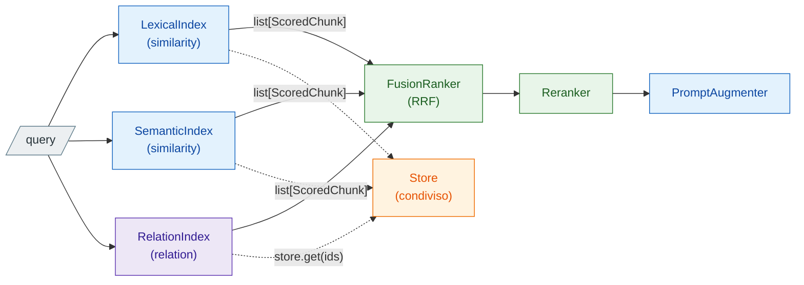

# Roadmap — il grafo di espansione

Una delle due estensioni di [l'architettura di base](../architecture.md); l'altra è
[multi-source + ABAC](sources-abac.md). Questa aggiunge un **grafo di relazioni** che allarga
l'insieme di chunk recuperati oltre a ciò che la similarità raggiunge.

È la tesi del progetto. Il vecchio nome della repo (`autograph-rag`) veniva da qui; dopo il
rename in `auth-rag` il nome indica l'altra estensione, l'ABAC.

## Stato (23 settembre 2026)

- **Implementato**, nel package `indexing/relation/`: `RelationIndex` (la ABC di famiglia,
  che tiene semi e funzione di score), `BaseExtractor`/`LLMExtractor`, e due tier —
  `VolatileGraphIndex` su networkx e `RemoteGraphIndex` su Neo4j.
- **La proprietà che reggeva tutto ha retto**: il grafo è entrato come un `BaseIndex`
  qualsiasi, `QueryPipeline` non è stata toccata, e l'unica riga cambiata in `BaseIndex` è
  l'over-fetch — che non nomina il grafo.
- **Le cinque decisioni sono chiuse**; la sezione in fondo dice come e perché.
- **I due tier sono verificati alla pari.** Le quattordici proprietà che contano sono
  scritte una volta e parametrizzate su entrambi, e passano su entrambi — `RemoteGraphIndex`
  è stato eseguito contro un Neo4j 5 vero. Senza `AUTH_RAG_TEST_NEO4J` quei test vengono
  saltati, quindi di default ne girano solo quattordici su ventotto.
- **Manca il tier `Persistent`**: networkx non ha un on-disk e Neo4j non ha un embedded
  Python, quindi il grafo ha due tier invece di tre.
- **L'harness continua a non esserci**, e questa volta la sequenza è andata al contrario
  rispetto a quanto raccomandato qui sotto. Vedi l'ultima sezione.

## L'inversione rispetto a GraphRAG

Nel Graph RAG canonico il grafo **è** l'indice: un estrattore di entità e relazioni costruisce
una base di conoscenza in cui ogni nodo è un'embedding specifica, e la query naviga il grafo
per trovare i chunk correlati. Questo pretende che l'estrazione sia accurata abbastanza da
produrre relazioni informative e non ridondanti — cioè pretende esperti di dominio e un costo
di costruzione alto.

Qui i ruoli sono invertiti:

> il **vector store resta l'indice principale**; il grafo ci sta sopra e serve **solo** a
> espandere il contesto.

Tre conseguenze che definiscono il design:

- **I nodi sono sottoconcetti**, non embedding. Più sottoconcetti possono risolvere allo
  stesso chunk, il che dà a un singolo vettore **più punti d'ingresso relazionali**.
- **Gli archi collegano chunk diversi** legati da una relazione esplicita, ed è lì che si
  guadagna: proprio quando quei chunk **non sono semanticamente simili**, e la similarità da
  sola non li avrebbe mai messi insieme.
- **Il grafo può essere grossolano.** Gli basta registrare che due nodi appartenenti a chunk
  diversi sono in relazione; non deve essere una mappa fedele del dominio. Quindi è leggero
  da costruire e poco costoso da mantenere — che è tutto il punto economico della tesi.

Al momento della query si parte come in un RAG classico, entrando per similarità, e il grafo
**allarga** il risultato.

## Dove si innesta

```mermaid
flowchart LR
    q[/"query"/]:::io --> BM["LexicalIndex<br>(similarity)"]:::step
    q --> VR["SemanticIndex<br>(similarity)"]:::step
    q --> GR["RelationIndex<br>(relation)"]:::new
    BM -- list[ScoredChunk] --> F["FusionRanker<br>(RRF)"]:::rank
    VR -- list[ScoredChunk] --> F
    GR -- list[ScoredChunk] --> F
    F --> RR["Reranker"]:::rank --> AUG["PromptAugmenter"]:::step
    GR -.->|"store.get(ids)"| ST["Store<br>(condiviso)"]:::store
    VR -.-> ST
    BM -.-> ST

    classDef io fill:#eceff1,stroke:#607d8b,color:#263238
    classDef step fill:#e3f2fd,stroke:#1565c0,color:#0d47a1
    classDef new fill:#ede7f6,stroke:#5e35b1,color:#311b92
    classDef rank fill:#e8f5e9,stroke:#2e7d32,color:#1b5e20
    classDef store fill:#fff3e0,stroke:#ef6c00,color:#e65100
```

Il grafo è un **`BaseIndex` come gli altri**: `insert`/`delete`/`retrieve`, tiene solo id più
la sua rappresentazione, risolve i chunk dallo `Store` condiviso e restituisce
`list[ScoredChunk]` che il `FusionRanker` fonde. Nessun trattamento speciale nella pipeline,
e nessuna modifica a `QueryPipeline` — verificato, non solo sperato.

Lo split fra le due famiglie è **per come si assegna la rilevanza**: `similarity` valuta ogni
chunk per conto suo, `relation` lo valuta per le sue relazioni. È anche il motivo per cui
`BaseIndex` non importa nessun backend.

A differenza di `similarity/index.py`, che contiene la meccanica Qdrant condivisa fra denso e
sparso, in `relation/index.py` non c'è niente di quel tipo da condividere: networkx e un graph
DB sono motori genuinamente diversi, non due modi di costruire lo stesso client. Quello che
`RelationIndex` tiene è ciò che rende i due tier **una famiglia** — come una query diventa semi
e come una traversata diventa uno score — e lascia ai tier `_add`, `_seeds`, `_expand` e
`delete`. Le prime stesure prevedevano invece una ABC *pura* più una porta di capacità
`RelationEngine`: superato, perché con quattro metodi astratti sull'index l'engine sarebbe un
secondo livello di indirezione che non porta niente, e la simmetria con `similarity/` conta di
più.

L'arco tratteggiato `SemanticIndex ⇢ RelationIndex` **non esiste**: i semi se li cerca il grafo
da solo, sui nomi dei propri nodi. Vedi la sezione sulle decisioni.

## Il problema centrale: da un cammino a uno score

`_search` deve restituire `(chunk_id, score)`, "più alto = più rilevante". Da una traversata
ottieni **raggiungibilità**, non una misura di similarità. Come la si converte è la scelta
tecnica più delicata, e le opzioni non sono equivalenti:

| criterio | pro | contro |
|---|---|---|
| decadimento per distanza (`seed * α^hop`) | semplice, monotono, un parametro | ignora quanto la relazione sia forte |
| numero di cammini distinti | premia la corroborazione | costoso, sensibile alla densità del grafo |
| peso o confidenza dell'arco | più informativo | dipende dalla calibrazione di un LLM |
| score del seme propagato | mantiene la scala della similarità | appiattisce tutti i vicini di uno stesso seme |

**Conseguenza da mettere per iscritto prima di scegliere.** Qualunque di questi score **non è
commensurabile** con un cosine o con BM25. A RRF non importa, perché legge solo le
**posizioni** dentro ogni lista. Ma RSF e DBSF normalizzano su minimo/massimo e su
media/deviazione della lista, quindi darebbero al grafo un peso arbitrario deciso dalla forma
della curva di decadimento. Detto altrimenti: **introdurre il grafo vincola il fusion ranker
a RRF**, a meno di calibrare esplicitamente gli score del grafo — cosa che senza harness di
valutazione non si può fare.

> **Scelto il decadimento per distanza**, `seed * decay ** hop`, con `decay` in `(0, 1)`
> validato nel costruttore. Vive in `RelationIndex._search`, quindi è uno solo per tutti i
> tier: `_expand` restituisce `(chunk_id, hop, seed score)` e il punteggio lo calcola la ABC.
> Un chunk raggiungibile per più cammini prende il **migliore**, ed è il motivo per cui la
> visita parte da un seme alla volta invece che da una frontiera unica — un nodo lontano da un
> seme forte può battere lo stesso nodo vicino a un seme debole, e una frontiera sola dovrebbe
> scegliere prima di sapere quale delle due vince. I pari merito si rompono sull'id, così lo
> stesso grafo risponde sempre allo stesso modo.
>
> **Il vincolo su RRF è quindi attivo**: con `RelativeScoreFusionRanker` o
> `DistributionScoreFusionRanker` il grafo pesa quanto dice la curva, non quanto vale.

## Costruzione: nodi, archi, e il problema dell'idempotenza

In ingestion serve un estrattore che, letto un chunk, produca i sottoconcetti e le relazioni.
I nodi si **fondono per nome** fra chunk diversi: è esattamente ciò che crea i ponti.

La fusione per nome ha però una conseguenza che vale anche fuori dalla sicurezza: **un nodo
appartiene a più chunk**, quindi non è un buon posto in cui mettere niente di specifico di un
chunk. Gli **archi** invece hanno provenienza univoca, perché l'estrattore legge un chunk per
volta.

**Il vincolo che sottovaluterei a mio rischio.** Un estrattore LLM non è deterministico,
mentre gli id dei chunk sono content-hash e lo store fa upsert idempotente. Se la stessa riga
di testo produce nodi diversi a ogni ingestione, il grafo divergerebbe dai chunk e la
re-ingestione smetterebbe di essere un'operazione neutra. È lo stesso problema che ha fatto
rimandare il labeler *inferito* — solo che qui non si può rimandare, perché il grafo **è**
inferenza. Due modi per uscirne: estrazione a temperatura zero con prompt e modello
versionati, oppure grafo ricostruito per sorgente invece che per chunk.

> **Presi tutti e due**, perché coprono due fallimenti diversi. `LLMExtractor` chiama sempre a
> `temperature=0.0` ed espone `version`, l'impronta di prompt+modello: stessa `version` e
> grafo diverso vuol dire che l'estrattore ha derivato, `version` diversa vuol dire che
> gliel'abbiamo chiesto noi. E `delete(source_id)` toglie tutti gli archi di quella sorgente
> più i nodi rimasti senza nessun chunk, quindi `delete` + `insert` **ricostruisce** una
> sorgente invece di rattopparla: un'estrazione che è cambiata non può lasciare archi stantii.
>
> Terzo pezzo, più noioso ma necessario: i nomi dei nodi passano per `normalize` (minuscole,
> spazi collassati) prima di diventare nodi. La fusione per nome è il meccanismo dei ponti, e
> senza normalizzazione sarebbero maiuscole e spaziature a decidere se un ponte esiste.

## L'ABAC sul grafo — la decisione che bloccava tutto

L'analisi sta in [sources-abac.md](sources-abac.md#chiuso-labac-sul-graphindex). Il
 riassunto,
con ciò che è cambiato da allora:

Sui due index per similarità il filtro è una condizione sulla **selezione dei candidati**. Sul
grafo no: l'espansione avviene per **traversata**, quindi il filtro interagisce con la
*raggiungibilità* — il sottografo percorribile è diverso per ogni soggetto, e i cammini che
esistono per uno non esistono per un altro.

- **Attributi sugli archi, filtro a ogni hop.** Espansione dimostrabilmente chiusa: il
  sottografo raggiunto deriva solo da dati che il soggetto può vedere. Prezzo: un costrutto
  critico per la sicurezza dove un errore è un leak silenzioso, e difficile da coprire con i
  test.
- **Traversata libera, filtro sui chunk risultanti.** Uniforme — gli attributi restano solo
  sul chunk, un solo punto di filtro — e nessuna duplicazione di dati di sicurezza nel grafo,
  quindi nessuna staleness.

**Cosa è realmente in gioco**: non un leak di contenuto, perché `_search` restituisce solo
`(chunk_id, score)` e i nodi intermedi non sono osservabili. È un **canale inferenziale**: un
cammino che passa per chunk vietati può far risalire in classifica un chunk *autorizzato* che
altrimenti non c'entrava, quindi l'ordinamento di ciò che vedi dipende da ciò che non vedi — e
con molte query mirate diventa sondabile.

> **Novità del 27 agosto, e sposta il conto.** `access` ora sta su **`Source`** e non su
> `Metadata`, quindi gli attributi sono **uniformi per documento** e un chunk non può averne
> di propri. Un arco nasce da un chunk, quindi eredita gli attributi del suo documento: la
> prima posizione costa meno di quanto sembrasse, perché non serve un modello di sicurezza
> nuovo per gli archi — basta propagare il `Source`. Resta vero però che sarebbe un **secondo
> punto di enforcement** da tenere allineato al primo, e che l'enforcement duplicato è
> precisamente il tipo di cosa che diverge in silenzio.

> **Chiusa sulla seconda posizione (23 settembre).** Il grafo non filtra: espande liberamente
> e `BaseIndex.retrieve` applica il predicato una volta sola, come per gli altri due index.
> Vince l'argomento del secondo punto di enforcement — un controllo per-hop sarebbe la stessa
> regola scritta in due posti, e due posti divergono.
>
> Il prezzo è quello già descritto sopra e viene **accettato, non risolto**: il canale
> inferenziale resta. Con molte query mirate l'ordinamento è sondabile. Vale la pena rileggerlo
> il giorno in cui il corpus fosse abbastanza sensibile da rendere il *rank* un'informazione.

Scelta la seconda posizione, servivano le due cose annotate qui:

- **L'over-fetch c'è.** `RelationIndex._search` restituisce `top_i * over_fetch` candidati e
  `BaseIndex.retrieve` taglia a `top_i` **dopo** il check, così un candidato non autorizzato
  non consuma uno slot in silenzio. È l'unica riga che il grafo ha richiesto in `BaseIndex`, e
  non nomina il grafo: vale per qualunque index i cui candidati vengano assottigliati dopo.
- **La deroga è annotata**: il principio "mai post-filtering" è consapevolmente sospeso per il
  solo stadio di espansione, dove costa bonus mancati e non risultati primari mancati. Resta
  intatto dove conta, cioè prima della fusione — i chunk che il grafo consegna al
  `FusionRanker` sono già solo quelli autorizzati.

## Cosa manca per sapere se il grafo paga

**Non esiste un harness di valutazione** (recall@k, nDCG). È un blocco trasversale già noto:
senza quello, RRF contro DBSF, quanto valga il reranker e **se il grafo migliori davvero il
recall** restano opinioni.

Per il grafo il problema è più acuto che per il resto del sistema. L'espansione per relazioni
ha un costo di costruzione — un LLM per chunk, in ingestion — e un costo di query, la
traversata. È l'unico componente il cui rapporto costo/beneficio **non si può stimare a
priori**, perché dipende interamente da quanto il corpus contenga relazioni fra chunk
semanticamente distanti. Costruirlo prima di poterlo misurare significa non sapere se tenerlo.

Quindi la sequenza sensata mette l'harness **prima** del grafo, non dopo.

> **E invece è andata al contrario.** Il grafo è stato scritto per primo, consapevolmente e
> su richiesta. Va quindi detto senza attenuanti: **funziona ma non sappiamo se paga**, e
> questo documento non contiene un solo numero che dica il contrario. Finché l'harness non
> esiste, "il grafo migliora il recall" resta la tesi del progetto e non un risultato.
>
> Il prossimo passo utile non è estendere il grafo: è misurarlo.

## Le cinque decisioni, e come sono state chiuse

| # | decisione | esito | dove vive |
|---|---|---|---|
| 1 | **ABAC sul grafo** | traversata libera, filtro solo sui chunk finali; canale inferenziale accettato, over-fetch aggiunto | `RelationIndex` (docstring), `BaseIndex.retrieve` |
| 2 | **Da dove vengono i semi** | ricerca propria sui nomi dei nodi: le liste che arrivano al `FusionRanker` restano indipendenti | `RelationIndex._seeds`, `terms()` |
| 3 | **La funzione di score** | decadimento per distanza, `seed * decay ** hop`; **vincola il ranker a RRF** | `RelationIndex._search` |
| 4 | **Determinismo dell'estrattore** | temperatura 0 + `version` (impronta di prompt+modello) + ricostruzione per sorgente + `normalize` sui nomi | `LLMExtractor`, `delete` dei tier |
| 5 | **Se l'harness viene prima** | **no** — scelta consapevole, contro la raccomandazione di questo documento | vedi il riquadro qui sopra |

Sulla 2 il documento prevedeva che servisse "un indice lessicale sui concetti". Non è servito:
i nomi dei nodi sono pochi e corti rispetto ai chunk, quindi il match è una sovrapposizione di
insiemi di token calcolata sul posto, coi token messi in cache sul nodo. `max_seeds` limita
quante porte una query può aprire, perché una parola comune aprirebbe mezzo grafo.

## Sequenza di rilascio — proposta, e com'è andata

| | proposto | fatto |
|---|---|---|
| 1 | **Harness di valutazione** — recall@k e nDCG | ❌ **saltato**, ed è il debito aperto |
| 2 | `RelationEngine` + `relation/index.py` come ABC pura | ⚠️ solo `RelationIndex`: l'engine separato è stato abbandonato, i tier implementano `_add`/`_seeds`/`_expand`/`delete` direttamente. Più simmetrico con `similarity/` |
| 3 | **Tier volatile su networkx**, per primo | ✅ `VolatileGraphIndex`, ed è quello su cui girano i test |
| 4 | **Estrattore**, col vincolo di determinismo | ✅ `LLMExtractor`, temperatura 0 e `version`. Vive nell'index, non nella `IngestionPipeline`: è la rappresentazione di questo index, come il vettore lo è del semantico |
| 5 | **Misurare** | ❌ non fatto, perché dipende dal punto 1 |
| 6 | **Tier remoto**, solo se il 5 dice di sì | ⚠️ `RemoteGraphIndex` scritto comunque, su richiesta — ma verificato contro un Neo4j 5 vero, alla pari col tier volatile |

Resta quindi **una cosa sola, ed è la prima della lista**: l'harness. È l'unico modo per
chiudere i punti 1 e 5, cioè per sapere se il grafo vada tenuto.

E una seconda, se e quando servirà: il tier `Persistent`, che oggi manca perché networkx non
ha un on-disk e Neo4j non ha un embedded Python. Serializzare il grafo in GraphML sarebbe la
strada, ma è lavoro da fare solo quando qualcuno lo chiede.
